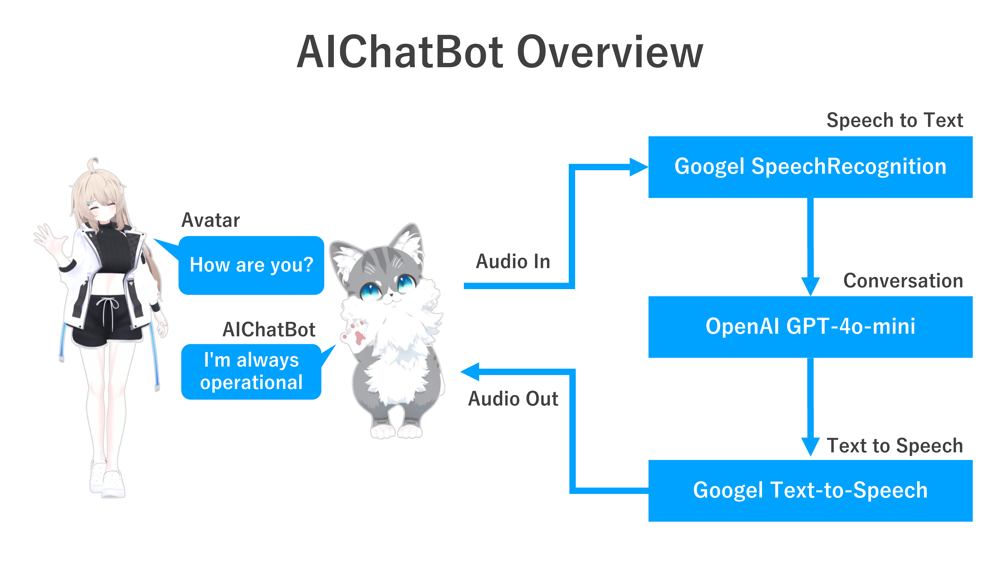

# AIChatbot for VRC/cluster/Etc



# ✨ 特徴

- VRChatやclusterなどのメタバースプラットフォームはもちろん、現実世界のデバイスでも使用可能
- GPT-4o-miniやGoogle STT/TTSを利用し、デバイスのスペックに関係なく高速なリアルタイム会話が実現
- 会話履歴の保存が可能で、継続的な対話をサポート
- WindowsおよびMacに対応し、幅広い環境で実行可能


# ☕️ Mac版の準備物

- GoogleのAPIキー（Speech-to-Text、Text-to-Speech）
- OpenAIのAPIキー（ChatGPT）
- Python 3.10 (Runtime)
- Git (Clone repo)
- Homebrew (Install module)
- [BlackHole](https://existential.audio/blackhole/)と[VB-Cable](https://vb-audio.com/Cable/)（Virtual audio）


# 🚩Mac版のインストール

```terminal
git clone https://github.com/nayu-frontline/AIChatbot.git
cd AIChatbot

brew install portaudio
pip3 install --upgrade -r requirements.txt
```

## Google APIの設定
ユーザディレクトリの直下の.zshrcファイルに以下を追記してください。
```
export PATH=$PATH:/opt/homebrew/bin/
```
なお、.zshrcファイルは隠しファイルとして設定されるので、ユーザディレクトでcommand、shift、.キーを同時に押すことで表示できます。
もし.zshrcファイルがなければ、以下のコマンドを実行してファイルを作成し、作成したファイルを開いて上記を追記してください。参考：https://god48.com/zsh-path

```terminal
cd ~
touch .zshrc
```

GoogleのSpeech-to-Text、Text-to-SpeechのAPIを使用するので、以下のサイトを参考に、サービスアカウントを作成して、秘密鍵をPCに保存してください。参考：https://qiita.com/vongole12gk/items/2e3a9359c39b5556e8c8

保存した秘密鍵のパスを.zshrcファイルに追記して保存します。
```
export GOOGLE_APPLICATION_CREDENTIALS="秘密鍵のパス.json"
```

## OpenAI APIの設定

main.pyの15行目に取得したOpenAIのAPIキーを入力してください。この方式に従わずに、環境変数を使用しても良いです。
```
client = OpenAI(api_key='あなたのAPIキー')
```

## 仮想オーディオの設定
以下の２つの仮想オーディオをインストールしてください。
* BlackHole https://existential.audio/blackhole/
* VB-Cable https://vb-audio.com/Cable/


# 🚀 実行

```
python main.py
```


実行すると以下のようにマイクの入出力設定を求められます。適宜設定を行なってください。
```
Available audio devices:
Device 0: BlackHole 2ch
Device 1: MacBook Airのスピーカー
Device 2: VB-Cable
Enter the number of the audio output device you want to use: 1
Available microphones:
Device 0: BlackHole 2ch
Device 1: MacBook Airのマイク
Device 2: MacBook Airのスピーカー
Device 3: VB-Cable
Enter the number of the microphone you want to use: 1
```

clusterで使用する場合：
* Macの設定アプリの出力：VB-cable
* Pythonの出力: BlackHole
* Pythonの入力：VB-Cable
* clusterアプリのマイク：Blackhole

Mac単体で使用する場合:
* Macの設定アプリの出力：MacBook Airのスピーカー
* Pythonの出力: MacBook Airのスピーカー
* Pythonの入力：MacBook Airのマイク

※Pythonの入出力については、はmain.py実行後に設定します。


# ☕️ Windows版の準備物

# 🚩Windows版のインストール

```
9月中旬に公開予定
```

## Google APIの設定
```
```

## OpenAI APIの設定

main.pyの15行目に取得したOpenAIのAPIキーを入力してください。この方式に従わずに、環境変数を使用しても良いです。
```
client = OpenAI(api_key='あなたのAPIキー')
```

## 仮想オーディオの設定


# 🚀 実行


# LICENSE
MIT LICENSE